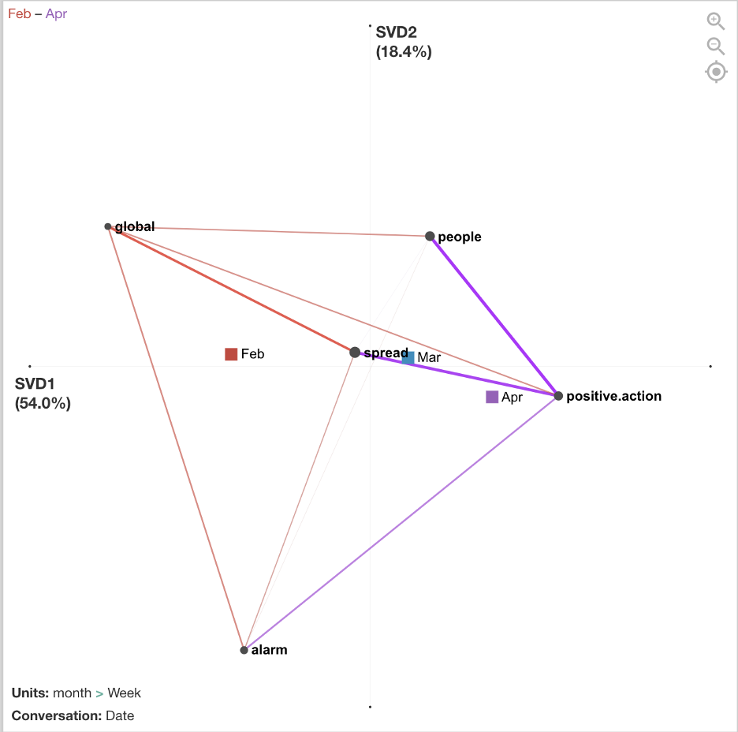
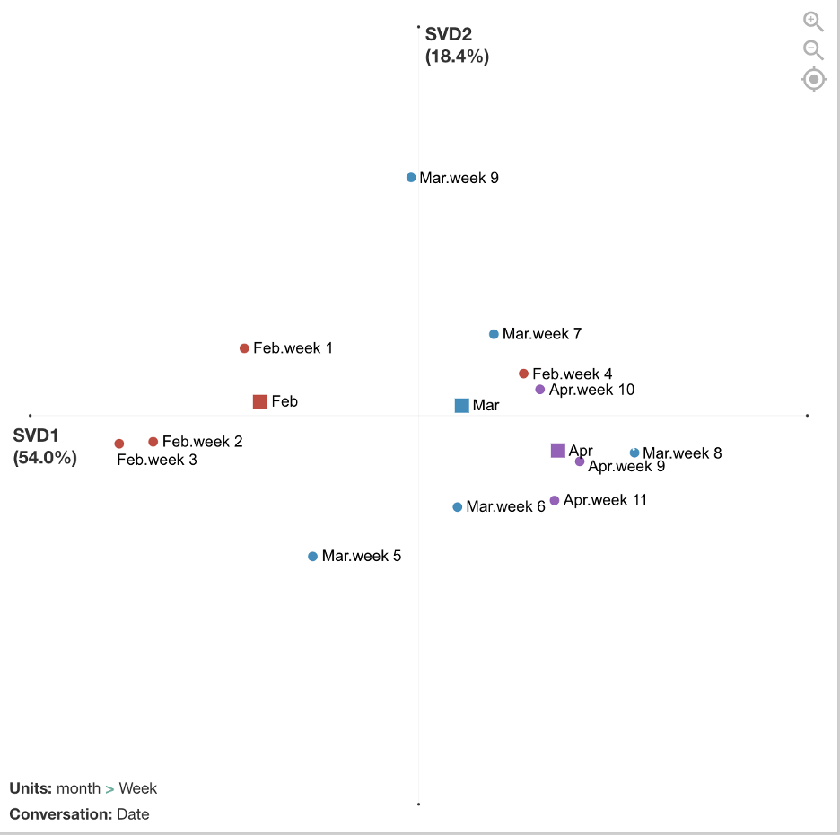

</br>

## Background
<p>
I was on the <a href="http://qesoc.org/" target="_blank">International Society for Quantitative Ethnography</a> (ISQE) <a href="https://sites.google.com/wisc.edu/qe-covid-data-challenge" target="_blank">COVID-19 Data Challenge</a> organization committee. And to promote the data challenge, I created a working example for how Quantitative Ethnography can be used to analyze COVID-19 data and provide insights into how people are thinking about the global pandemic. </p>
<p>
I used a dataset of U.S. CDC tweets from Feb, March, and part of April 2020 that I downloaded from <a href="https://github.com/narcisoyu/Institional-and-news-media-tweet-dataset-for-COVID-19-social-science-research" target="_blank">narcisoyu's github</a>. I added some variables and then coded the tweets for 6 themes, used the <a href="http://www.n-coder.org/" target="_blank">nCoder</a> webtool to validate the codes (thanks to Jais Brohinsky and Kamila Misiejuk), and used the <a href="http://www.epistemicnetwork.org/" target="_blank">Epistemic Network Analysis</a> webtool to visualize how the CDC's information to the public changed as the global pandemic continued. 
</p>


```{r setup, include=FALSE, warning = FALSE, message = FALSE}

knitr::opts_chunk$set(echo = TRUE)

```

</br>
## Prepping the Data

I used the following packages and removed sci notation (it was driving me crazy!).

```{r, warning= FALSE, message = FALSE}
library(tidyverse)
library(tidytext)
library(topicmodels)

options(scipen=999)
```

</br>

```{r, include = FALSE}
tweets <- read_csv("/Users/golnazirgens/Box/Data Science Hobby/website/covid/cdctweetsforR.csv")
```

This is a tibble (a quick look) at the dataset. All files can be found in my <a href="https://github.com/gol-like-soccer-goal/covid" targer="_blank">covid repository</a>.
```{r tweets}
tweets
```

</br>
I added a year and month column
```{r, message=FALSE}
tweets <- tweets %>%
  mutate(month = substring(created_at, 5, 7)) %>%
  mutate(year = substring(created_at, nchar(created_at)-3, nchar(created_at))) %>%
  filter(year == "2020") %>%
  filter(month == "Feb" | month == "Mar" | month == "Apr")
```
</br>
## Coding the Data
To explore the dataset beyond just reading the tweets, I tried word frequencies, 
```{r, message=FALSE}
tweets.words <- tweets %>%
  select(text) %>%
  unnest_tokens(word, text) %>%
  anti_join(stop_words) %>%
  filter(word != "https") %>%
  filter(word != "t.co") %>%
  filter(word != "rt") %>%
  filter(word != "cdc") %>%
  filter(word != "covid19") %>%
  filter(word != "covid") %>%
  filter(word != "coronavirus") %>%
  filter(word != "amp") %>%
  count(word, sort = TRUE)

tweets.words %>%
  top_n(15) %>%
  ggplot(aes(fct_reorder(word, n), n, fill = word)) +
  geom_col(show.legend = FALSE) +
  labs(x = "word", y = "frequency") +
  coord_flip()
```
</br>
bigrams, 

```{r, message=FALSE}
tweets.bi <- tweets %>%
  select(text) %>%
  unnest_tokens(bigram, text, token="ngrams", n = 2) %>%
  count(bigram, sort = TRUE)

tweets.bi %>%
  top_n(15) %>%
  ggplot(aes(fct_reorder(bigram, n), n, fill = bigram)) +
  geom_col(show.legend = FALSE) +
  labs(x = "bigram", y = "frequency") +
  coord_flip()

```
</br>
and even topic modeling with LDA. 

```{r, message=FALSE}
##create document term matrix
tweets.dtm <- tweets %>%
  select(text,id) %>%
  unnest_tokens(word, text) %>%
  anti_join(stop_words) %>%
  count(word, id, sort = TRUE) %>%
  ungroup() %>%
  filter(word != "https") %>%
  filter(word != "t.co") %>%
  filter(word != "rt") %>%
  filter(word != "cdc") %>%
  filter(word != "covid19") %>%
  filter(word != "covid") %>%
  filter(word != "coronavirus") %>%
  cast_dtm(id, word, n)

##take out tweets with no terms so LDA doesn't fail
rowTotals <- apply(tweets.dtm, 1, sum)
tweets.dtm <- tweets.dtm[rowTotals > 0 , ]

##run LDA
tweets.lda <- LDA(tweets.dtm, k = 10, control = list(seed = 1234))
tweets.lda.tidy <- tidy(tweets.lda)

##Show top words in each topic
tweets.lda.top <- tweets.lda.tidy %>%
  group_by(topic) %>%
  top_n(10, beta) %>%
  arrange(topic, -beta) %>%
  ungroup()

##Plot top words in each topic
tweets.lda.top %>%
  mutate(term = reorder(term,topic)) %>%
  ggplot(aes(fct_reorder(term, beta), beta, fill = topic)) +
  geom_col(show.legend = FALSE) +
  facet_wrap(~ topic, scales = "free") +
  coord_flip()

```
</br>
</br>
It wasn't very helpful, but it did point out the most frequently used words and phrases. So, I went back to the data with this information to find common themes in the CDC tweets. 
</br>
## Coding the Data

</br>
I developed five codes: 

<style>
table {
  font-family: arial, sans-serif;
  border-collapse: collapse;
  width: 100%;
}

td, th {
  border: 1px solid #dddddd;
  text-align: left;
  padding: 8px;
}

tr:nth-child(even) {
  background-color: #dddddd;
}
</style>

<table>
  <tr>
    <th>Code</th>
    <th>Definition</th>
    <th>Sample Keywords</th>
  </tr>
  <tr>
    <td>People</td>
    <td>Referring to different populations of people affected by covid-19</td>
    <td>People,  child, adult, elderly</td>
  </tr>
  <tr>
    <td>Positive Action</td>
    <td>Referring to an action that people can take to cope with or stay safe from covid-19</td>
    <td>Social distanc, #socialdist, reduce, disinfect</td>
  </tr>
  <tr>
    <td>Infection and Spread</td>
    <td>Referring to the spread, transmission of or exposure to covid-19. Also refers to explicitly referring to someone who is sick with the virus or may potentially become sick with covid-19.</td>
    <td>Spread, close contact, widespread, transmission</td>
  </tr>
  <tr>
    <td>Alarm</td>
    <td>Using language that conveys complications, those who are at a more serious risk,  death, or sense of alarm related to covid-19. </td>
    <td>Risk, death, emergency, threat, expose, severe, complication, serious</td>
  </tr>
  <tr>
    <td>Global</td>
    <td>Referring to other countries or global effects of covid-19 beyond the U.S.</td>
    <td>China, traveler, global, world, Korea, Japan, Congo</td>
  </tr>
</table>

</br>
And developed a full set of keywords and regular expressions based on the definitions of the codes that were validated in nCoder. Not all codes passed the statistical threshold, so this is still a work in progress. 

```{r, include = FALSE}
keywords <- read.csv("/Users/golnazirgens/Box/Data Science Hobby/website/covid/keywords.csv")
```

Below is a function I wrote for coding the data. It takes the keyword file as an input and if the tweet contains the keyword, it will place a 1 in that column and if the tweet does not contain the keyword, it will place a 0 in that column. 
```{r, message = FALSE}
##this is a function for coding
code = function(keywordtable, colnum, content) {
  
  code <- unlist(paste(na.omit(keywordtable[,colnum]), collapse = "|"))
  out = ifelse(grepl(code, content, ignore.case = TRUE, perl = TRUE),1,0)
  return (out)
  
}

##code tweets
tweets$people <- code(keywords, 1, tweets$text)
tweets$spread <- code(keywords, 2, tweets$text)
tweets$alarm <- code(keywords, 3, tweets$text)
tweets$positive.action <- code(keywords, 4, tweets$text)
tweets$global <- code(keywords, 5, tweets$text)
```

## Visualizing the Data

</br>
After the data was coded, I exported the file as a csv and imported it into the ENA webtool.</br>
<p>
Stanzas (segmentations for how co-occurrences are counted) were by date. Sometimes there was one tweet on a date and sometimes there were several tweets. Units (individual networks) were accumulated by week and then grouped into red, blue, and purple networks by month. 
</p>
<p>
The figure below compares the average networks for Feb and Apr and shows the average centroids for all three months. The differences are not significant if we run statistics on the number of weeks (due to small sample size/low power), but the effect is relatively large (r = 1.0 on x-axis). Future analyses could examine statistics on a smaller grain size of networks, such as date or single tweets, to increase sample size. 
</p>


<p>
There are differences between February, March, and April in terms of how the CDC tweets were conveying information to the public, and the mean centroids show a trajectory across the space. In February, tweets focused more on people involved in the global spread of COVID-19. In March, tweets focused more on what positive actions people could take to cope with and reduce spread of COVID-19. April continued to focus on positive actions to reduce spread but included more alarming tweets about the severity and deaths. 
</p>
<p>
Below are examples of tweets from each month that match with the interpretation above. 
</p>
</br>
<table>
  <tr> <th>Example of Feb 21 (week 3) Tweet</th> 
<th>There are now 2 categories of #COVID19 cases in the US: 1) Cases detected through the domestic public health systems, and 2) cases among people who were repatriated via @StateDept flights from Wuhan (China) &amp; from the Diamond Princess cruise ship (Japan). https://t.co/1ifchVQ9jm.
</th></tr>
<tr> <th>Example of March 17 (week 7)  Tweet </th> 
<th>While #socialdistancing for #COVID19, take the time to check in on friends and family to see how they are doing. Set up a daily phone or video call to touch base and share the best and most challenging parts of the day. #TogetherApart 
 https://t.co/KyBmehvGcY https://t.co/rN1RmYS9i0 </th></tr>
<tr><th>Example of April 14 (week 11) Tweet</th>
<th>Did you know that adults 65 and older and those with an underlying medical condition are at higher risk for getting seriously ill from #coronavirus? Learn how to slow the spread of coronavirus and protect your loved ones at https://t.co/iH2iReYrBq. #COVID19 https://t.co/1KnsDJSJY3 </th></tr>
</table>

<p>
The figure below breaks out the networks by each week. February includes weeks 1 - 4, March includes weeks 5 - 9, April includes 9 - 11. This visualization shows more detailed trajectories on how the CDC tweets’ focus changed week by week. For example, in week 9 at the end of March, those tweets look more similar to the February tweets that had a global/travel focus. This was because many additional travel advisories went into effect during this week by the U.S. government. </p>

 

<p>
Additional possible analyses include exploring metadata from this dataset such as retweets, favorited/popular tweets, or media included in tweets. Also, end of April tweets were not included in this analysis and are now available for download and could be added. In addition, this tweet data could be correlated with metadata from other sources such as general tweets with #Covid19 hashtag, containment and mitigation measures, number of infections, etc. 
</p>

